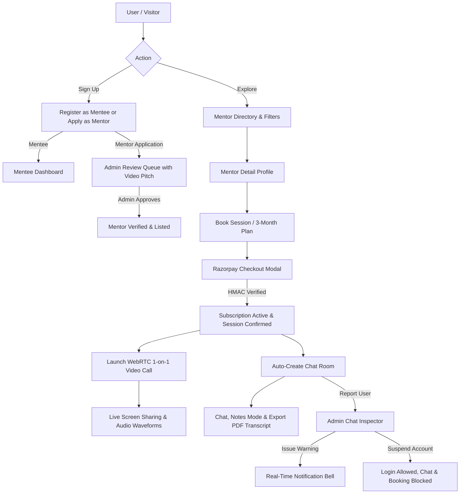

# 🚀 MentorHub — Next-Gen 1-on-1 Mentorship Marketplace & Live Coaching Arena

MentorHub is a full-stack live 1-on-1 mentorship marketplace, video coaching arena, and career transformation platform. It combines a high-performance **Django REST Framework (Backend)** with a reactive **React 18 + Vite (Frontend)** styled in a modern **Glassmorphism + Neubrutalism** hybrid design system.

---

## 📋 Table of Contents

1. [Core Features & Platform Capabilities](#-core-features--platform-capabilities)
2. [Tech Stack Breakdown](#-tech-stack-breakdown)
3. [Architecture & Workflow Diagram](#-architecture--workflow-diagram)
4. [Folder Structure](#-folder-structure)

---

## 🌟 Core Features & Platform Capabilities

### 🔍 1. Smart Mentor Discovery & Filter Engine

- Filter verified mentors by technical skills (`System Design`, `React`, `Python`, `AI/ML`, `DevOps`), minimum ratings (3★ to 5★), hourly rates, and years of experience.
- View mentor profiles, bio, badges, student reviews, and click **"Demo Pitch"** to stream their teaching preview video.

### 💳 2. Multi-Tier Mentorship Plans & Razorpay Checkout

- **Single 1-on-1 Coaching Session** (60 mins).
- **1-Month Mentorship Plan** with unlimited 1-on-1 session requests during the active term.
- **3-Month Career Transformation Plan** for comprehensive guidance, priority scheduling, and resume reviews.
- Seamless **Razorpay Checkout Modal** with HMAC-SHA256 signature verification and order tracking.

### 🎥 3. WebRTC 1-on-1 Video Calling & Screen Sharing

- Peer-to-peer encrypted audio/video streaming via native `RTCPeerConnection`.
- **Dual Signaling Relay**: Instant `BroadcastChannel` for local tabs + **Backend Signaling Relay API** (`/sessions/live/:id/signal/`) polled every 800ms for reliable cross-window/cross-browser connections.
- **Full HD Desktop Screen Sharing**: Uses `replaceTrack()` to switch between webcam and screen stream with zero call interruption.
- **60 FPS Animated Canvas Waveform Fallback**: Generates an animated studio avatar stream with live dynamic FFT audio bars if physical webcams are busy or restricted.

### 💬 4. Real-time Chat, Notes Mode & PDF Export

- Auto-syncs chat rooms for all booked sessions and subscriptions on both Mentee and Mentor sidebars.
- **Mentor Coaching Notes Mode**: Highlight critical advice as yellow Neubrutalist note cards.
- **Server-Side PDF Transcript Generation**: Export clean, styled PDF transcripts of coaching notes powered by Python `ReportLab`.
- File and code snippet attachments.

### 🔔 5. Real-Time Notification Bell

- Top navigation bar notification bell with dynamic unread counter badge.
- Slide-out notification drawer with color-coded alerts:
  - ⚠️ **Official Admin Warnings**
  - 🚫 **Account Suspension Alerts**
  - 🎉 **Mentor Profile Approvals**
  - 📅 **Session Request & Acceptance Confirmations**
- One-click **"Mark all read"** action.

### 🛡️ 6. Admin Control Center & Incident Moderation

- **Mentor Application Review Queue**: Watch pitch videos, inspect LinkedIn/GitHub links, and approve or reject with custom feedback.
- **User Violation Reporting**: Mentees and mentors can report off-platform scams or abusive behavior.
- **Admin Chat Inspector Modal**: Inspect full chat histories between parties with reported messages flagged in red.
- **Moderation Actions**: Issue official warnings (dispatched to user notification bell) or suspend accounts.
- **Suspension Policy**: Suspended users can still log in and view their dashboards, but chat messaging and new session bookings are blocked with clear warning banners.

---

## 🛠️ Tech Stack Breakdown

### Frontend

- **React 18** — Reactive SPA UI & Component Architecture
- **Vite 5** — Build tool & Hot Module Replacement dev server
- **React Router 6** — Declarative client-side routing & Protected Routes
- **Axios** — HTTP client with global JWT request/response interceptors
- **Native WebRTC API** — Peer-to-peer video streaming (`RTCPeerConnection`, `MediaStream`)
- **HTML5 Canvas & Web Audio API** — 60 FPS animated waveform video fallback
- **Lucide React** — Crisp SVG iconography
- **Custom Neo-Brutalist CSS** — Dark-mode glassmorphic theme with bold neon accents

### Backend

- **Python 3.10+** & **Django 4.2 LTS** — Robust ORM & backend framework
- **Django REST Framework (DRF)** — RESTful API architecture & class-based views
- **SimpleJWT** — Stateless JWT authentication & role-based access control
- **Razorpay API SDK** — HMAC-SHA256 order creation & payment signature verification
- **ReportLab** — Server-side PDF chat transcript generation
- **WhiteNoise** — Production static file serving with gzip compression
- **Gunicorn** — Multi-worker WSGI HTTP server
- **SQLite / PostgreSQL** — Relational database storage

---

## 🏗️ Architecture & Workflow Diagram


## 📁 Folder Structure

```text
Education-mentorship/
│
├── mentor_hub/                       # Django Backend
│   ├── accounts/                     # Authentication, Profiles, Notifications & Reports
│   │   ├── management/
│   │   │   └── commands/             # Custom Django management commands
│   │   │       └── seed_demo_data.py
│   │   ├── migrations/               # Database migrations
│   │   ├── api_views.py              # Authentication, Registration, Reports & Notifications APIs
│   │   ├── models.py                 # User, MentorProfile, MenteeProfile, UserReport, Notification
│   │   ├── serializers.py            # Account-related API serializers
│   │   ├── urls.py                    # Account URL routes
│   │   └── urls_api.py               # Account REST API routes
│   │
│   ├── chat/                         # Real-Time Chat, Notes & PDF Export
│   │   ├── migrations/               # Chat database migrations
│   │   ├── api_views.py              # Chat listing, messaging & PDF export APIs
│   │   ├── models.py                 # ChatRoom, Message
│   │   ├── serializers.py            # Chat API serializers
│   │   └── urls_api.py               # Chat API routes
│   │
│   ├── dashboard/                    # Admin Dashboard, Analytics & Moderation
│   │   ├── migrations/               # Dashboard database migrations
│   │   ├── api_views.py              # Mentor approval, rejection, statistics & moderation
│   │   ├── models.py                 # Dashboard-related models
│   │   ├── serializers.py            # Dashboard API serializers
│   │   └── urls_api.py               # Admin dashboard API routes
│   │
│   ├── sessions_app/                 # Sessions, Payments & WebRTC Signaling
│   │   ├── migrations/               # Session database migrations
│   │   ├── api_views.py              # Booking, Razorpay & WebRTC signaling APIs
│   │   ├── models.py                 # SessionRequest, MentorshipSubscription,
│   │   │                              # LiveSession, Review
│   │   ├── serializers.py            # Session API serializers
│   │   ├── razorpay_service.py       # Razorpay HMAC-SHA256 payment verification
│   │   └── urls_api.py               # Session API routes
│   │
│   ├── mentor_hub/                   # Django Project Configuration
│   │   ├── settings.py               # Django settings & environment configuration
│   │   ├── urls.py                   # Main URL configuration
│   │   ├── wsgi.py                   # WSGI application
│   │   └── asgi.py                   # ASGI application
│   │
│   ├── static/                       # Backend static assets
│   ├── media/                        # Uploaded media & user files
│   ├── manage.py                      # Django CLI
│   ├── requirements.txt              # Python production dependencies
│   ├── Procfile                      # Gunicorn process configuration
│   ├── build.sh                      # Render build script
│   └── render.yaml                   # Render deployment configuration
│
├── frontend/                         # React 18 + Vite Frontend
│   ├── public/                       # Public static assets
│   │
│   ├── src/
│   │   ├── api/                      # Axios API clients
│   │   │   ├── auth.js               # Authentication APIs
│   │   │   ├── chat.js               # Chat APIs
│   │   │   ├── admin.js              # Admin APIs
│   │   │   └── sessions.js            # Session & payment APIs
│   │   │
│   │   ├── components/               # Reusable UI components
│   │   │   ├── Navbar/
│   │   │   ├── NotificationDropdown/
│   │   │   ├── Modals/
│   │   │   └── ProtectedRoute/
│   │   │
│   │   ├── context/                  # Global React state
│   │   │   └── AuthContext.jsx        # JWT authentication & user state
│   │   │
│   │   ├── pages/                    # Application pages
│   │   │   ├── Landing/
│   │   │   ├── Mentors/
│   │   │   ├── MentorProfile/
│   │   │   ├── Dashboard/
│   │   │   ├── Chat/
│   │   │   ├── Call/
│   │   │   └── Admin/
│   │   │
│   │   ├── assets/                   # Images, icons & frontend assets
│   │   ├── App.jsx                   # Main React application
│   │   ├── main.jsx                  # React application entry point
│   │   └── index.css                 # Global Neo-Brutalist/Glassmorphism theme
│   │
│   ├── package.json                  # Frontend dependencies & scripts
│   ├── package-lock.json             # Locked dependency versions
│   ├── vite.config.js                # Vite configuration
│   └── vercel.json                   # Vercel SPA routing configuration
│
├── docs/                             # Functional Requirements & Non-Functional Requirements
│   ├── SRS complete requirements & DFD 
│   └──UML.pdf          
│
├── .env                              # Local environment variables
├── .gitignore                        # Git ignored files & secrets
├── README.md                         # Main project documentation
└── LICENSE                           # Project license


