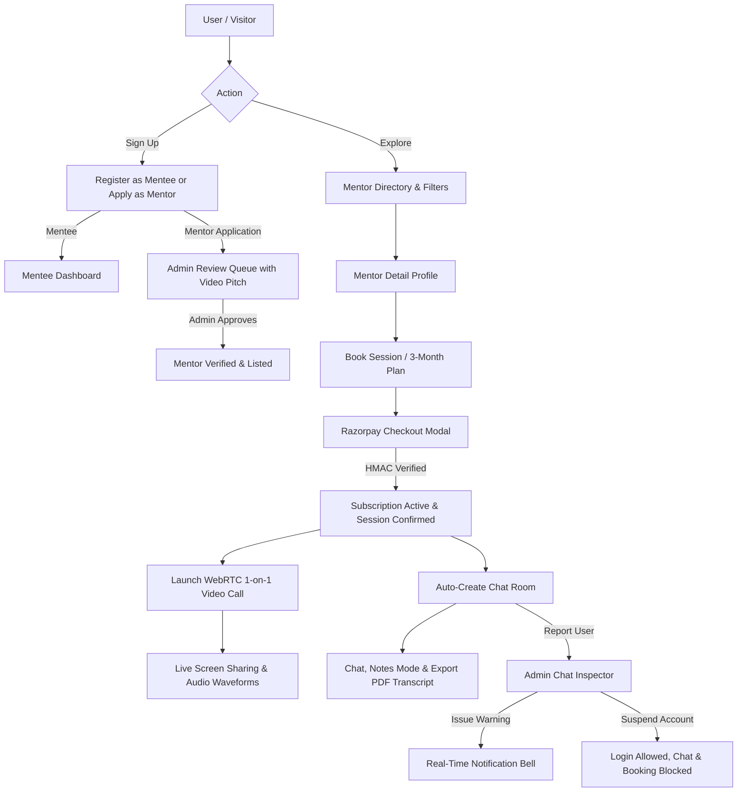

# 🚀 MentorHub — Next-Gen 1-on-1 Mentorship Marketplace & Live Coaching Arena

MentorHub is a full-stack live 1-on-1 mentorship marketplace, video coaching arena, and career transformation platform. It combines a high-performance **Django REST Framework (Backend)** with a reactive **React 18 + Vite (Frontend)** styled in a modern **Glassmorphism + Neubrutalism** hybrid design system.

---

> 📚 **Complete Project Documentation**:
> - 📖 [**Architecture, Tech Stack & Workflow Guide (`docs/ARCHITECTURE_AND_TECHSTACK.md`)**](./docs/ARCHITECTURE_AND_TECHSTACK.md)
> - 🚀 [**Production Deployment Manual (Vercel + Render + SQLite + Secrets) (`docs/DEPLOYMENT_GUIDE.md`)**](./docs/DEPLOYMENT_GUIDE.md)
> - 📤 [**GitHub Push & Easy Deployment Guide (`docs/GIT_PUSH_AND_DEPLOY_GUIDE.md`)**](./docs/GIT_PUSH_AND_DEPLOY_GUIDE.md)
> - 💳 [**Razorpay Integration Details (`RAZORPAY_SETUP.md`)**](./RAZORPAY_SETUP.md)


---

## 📋 Table of Contents
1. [Core Features & Platform Capabilities](#-core-features--platform-capabilities)
2. [Tech Stack Breakdown](#-tech-stack-breakdown)
3. [Architecture & Workflow Diagram](#-architecture--workflow-diagram)
4. [Prerequisites](#-prerequisites)
5. [Quick Start (Run Locally in 2 Minutes)](#-quick-start-run-locally)
6. [Demo User Credentials](#-demo-user-credentials)
7. [Step-by-Step Manual Testing Guide (10 Test Flows)](#-step-by-step-manual-testing-guide)
8. [Folder Structure](#-folder-structure)
9. [Production Deployment Overview](#-production-deployment-overview)
10. [Troubleshooting & FAQs](#-troubleshooting--faqs)

---

## 🌟 Core Features & Platform Capabilities

### 🔍 1. Smart Mentor Discovery & Filter Engine
- Filter verified mentors by technical skills (`System Design`, `React`, `Python`, `AI/ML`, `DevOps`), minimum ratings (3★ to 5★), hourly rates, and years of experience.
- View mentor profiles, bio, badges, student reviews, and click **"Demo Pitch"** to stream their teaching preview video ([`https://www.youtube.com/watch?v=A95rliroC8Q`](https://www.youtube.com/watch?v=A95rliroC8Q)).

### 💳 2. Multi-Tier Mentorship Plans & Razorpay Checkout
- **Single 1-on-1 Coaching Session** (60 mins).
- **1-Month Mentorship Plan** with unlimited 1-on-1 session requests during the active term.
- **3-Month Career Transformation Plan** for comprehensive guidance, priority scheduling, and resume reviews.
- Seamless **Razorpay Checkout Modal** with HMAC-SHA256 signature verification and order tracking.

### 🎥 3. WebRTC 1-on-1 Video Calling & Screen Sharing
- Peer-to-peer encrypted audio/video streaming via native `RTCPeerConnection`.
- **Dual Signaling Relay**: Instant `BroadcastChannel` for local tabs + **Backend Signaling Relay API** (`/sessions/live/:id/signal/` polled every 800ms) for reliable cross-window/cross-browser connections.
- **Full HD Desktop Screen Sharing**: Uses `replaceTrack()` to switch between webcam and screen stream with zero call interruption.
- **60 FPS Animated Canvas Waveform Fallback**: Generates an animated studio avatar stream with live dynamic FFT audio bars if physical webcams are busy or restricted.

### 💬 4. Real-time Chat, Notes Mode & PDF Export
- Auto-syncs chat rooms for all booked sessions and subscriptions on both Mentee and Mentor sidebars.
- **Mentor Coaching Notes Mode**: Highlight critical advice as yellow Neubrutalist note cards.
- **Server-Side PDF Transcript Generation**: Export clean, styled PDF transcripts of coaching notes powered by Python `ReportLab`.
- File and code snippet attachments.

### 🔔 5. Real-Time Notification Bell
- Top navigation bar notification bell with dynamic unread counter badge.
- Slide-out notification drawer with color-coded alerts:
  - ⚠️ **Official Admin Warnings**
  - 🚫 **Account Suspension Alerts**
  - 🎉 **Mentor Profile Approvals**
  - 📅 **Session Request & Acceptance Confirmations**
- One-click **"Mark all read"** action.

### 🛡️ 6. Admin Control Center & Incident Moderation
- **Mentor Application Review Queue**: Watch pitch videos, inspect LinkedIn/GitHub links, and approve or reject with custom feedback.
- **User Violation Reporting**: Mentees and mentors can report off-platform scams or abusive behavior.
- **Admin Chat Inspector Modal**: Inspect full chat histories between parties with reported messages flagged in red.
- **Moderation Actions**: Issue official warnings (dispatched to user notification bell) or suspend accounts.
- **Suspension Policy**: Suspended users can still log in and view their dashboards, but chat messaging and new session bookings are blocked with clear warning banners.

---

## 🛠️ Tech Stack Breakdown

### Frontend:
- **React 18** — Reactive SPA UI & Component Architecture
- **Vite 5** — Build tool & Hot Module Replacement dev server
- **React Router 6** — Declarative client-side routing & Protected Routes
- **Axios** — HTTP client with global JWT request/response interceptors
- **Native WebRTC API** — Peer-to-peer video streaming (`RTCPeerConnection`, `MediaStream`)
- **HTML5 Canvas & Web Audio API** — 60 FPS animated waveform video fallback
- **Lucide React** — Crisp SVG iconography
- **Custom Neo-Brutalist CSS** — Dark-mode glassmorphic theme with bold neon accents

### Backend:
- **Python 3.10+** & **Django 4.2 LTS** — Robust ORM & backend framework
- **Django REST Framework (DRF)** — RESTful API architecture & class-based views
- **SimpleJWT** — Stateless JWT authentication & role-based access control
- **Razorpay API SDK** — HMAC-SHA256 order creation & payment signature verification
- **ReportLab** — Server-side PDF chat transcript generation
- **WhiteNoise** — Production static file serving with gzip compression
- **Gunicorn** — Multi-worker WSGI HTTP server
- **SQLite / PostgreSQL** — Relational database storage

---

## 🏗️ Architecture & Workflow Diagram



---

## 💻 Prerequisites

Ensure you have installed:
- **Python 3.10+** (`python --version`)
- **Node.js 18+** & **npm** (`node --version` and `npm --version`)
- **Git**

---

## ⚡ Quick Start (Run Locally)

### 1. Terminal 1 — Start Django Backend

```powershell
# Navigate to project root:
cd "c:\Users\kaila\OneDrive\Desktop\guidance hub\mentor_hub"

# 1. Activate Python virtual environment:
.\venv\Scripts\activate

# 2. Run Database Migrations:
python manage.py makemigrations accounts sessions_app chat dashboard
python manage.py migrate

# 3. Seed Fresh Demo Data (Indian Mentors, Mentees & Incident Reports):
python manage.py seed_demo_data

# 4. Start Django Backend Server:
python manage.py runserver 0.0.0.0:8000
```
> 🌐 Backend API runs at: **http://127.0.0.1:8000**

---

### 2. Terminal 2 — Start React Frontend

```powershell
# Open a new terminal and navigate to frontend:
cd "c:\Users\kaila\OneDrive\Desktop\guidance hub\mentor_hub\frontend"

# 1. Install NPM packages:
npm install

# 2. Launch Vite Dev Server:
npm run dev
```
> 🌐 Frontend runs at: **http://localhost:3000**

---

## 🔑 Demo User Credentials

The `seed_demo_data` command initializes pre-configured demo accounts:

| Role | Username | Password | Full Name & Platform Role |
| :--- | :--- | :--- | :--- |
| 👑 **Administrator** | `admin` | `admin123` | **Kailash (Admin)** — Full platform oversight, mentor approvals & chat inspector |
| 🎓 **Approved Mentor** | `mentor_ankit` | `ankit123` | **Ankit Mishra** — Cloud & System Design Lead (10 yrs exp, ₹799/hr) |
| 🎓 **Approved Mentor** | `mentor_yanshu` | `yanshu123` | **Yanshu Patel** — Staff Frontend & React Lead (7 yrs exp, ₹599/hr) |
| 🎓 **Approved Mentor** | `mentor_amit` | `amit123` | **Amit Sharma** — AI/ML Engineering Lead (9 yrs exp, ₹899/hr) |
| ⏳ **Pending Mentor** | `mentor_pankaj` | `pankaj123` | **Pankaj Verma** — DevOps Lead (Awaiting Admin Review with Demo Pitch) |
| 🚀 **Mentee / Student** | `mentee_dholi` | `dholi123` | **Dholi Kumari** — Active 3-Month Plan Subscriber |
| 🚀 **Mentee / Student** | `mentee_rohit` | `rohit123` | **Rohit Sharma** — Booked Mentee |
| 🚀 **Mentee / Student** | `mentee_dinesh` | `dinesh123` | **Dinesh Meena** — Booked Mentee |
| 🚩 **Flagged Bad Actor** | `crypto_spammer` | `spammer123` | **Crypto Scammer** — Reported for off-platform financial promotion |

> 💡 **1-Click Login Tip:** On the Login page (`/login`), click any of the **1-Click Demo Fill** buttons to autofill credentials instantly!

---

## 🧪 Step-by-Step Manual Testing Guide

Follow these 10 end-to-end verification workflows:

---

### Flow 1: Mentor Application with Demo Pitch Video
1. Open [http://localhost:3000/apply](http://localhost:3000/apply).
2. Fill out the application with your credentials, skills, hourly rate, and video link ([`https://www.youtube.com/watch?v=A95rliroC8Q`](https://www.youtube.com/watch?v=A95rliroC8Q)).
3. Click **"Submit Mentor Application"** ➡️ Redirects to the pending review screen.
4. Try logging in at `/login` ➡️ Notice access is restricted until approved.

---

### Flow 2: Admin Video Pitch Review & Mentor Approval
1. Log in as **Admin** (`admin` / `admin123`) ➡️ Open `/admin/dashboard`.
2. Under **"Mentor Approval Queue"**, locate **Pankaj Verma** (`mentor_pankaj`).
3. Click **"▶ Watch Demo Pitch Video"** ➡️ The modal opens and streams the applicant's intro video.
4. Click **"✓ Approve Mentor"** ➡️ Status updates to `approved` and the mentor goes live in the directory.
5. In Pankaj's account, notice a **🎉 Mentor Profile Approved** alert appears in his Navbar notification bell!

---

### Flow 3: Mentee Multi-Filter Discovery & Demo Video Preview
1. Open [http://localhost:3000/mentors](http://localhost:3000/mentors).
2. Filter mentors by skill (e.g. `System Design`, `AI/ML`, `React`), price range, and rating.
3. Click **"Demo Pitch"** on Ankit Mishra's card to watch his preview pitch video.
4. Click **"View Profile & Book"** to inspect his full profile, skills badges, and student reviews.

---

### Flow 4: Mentorship Subscription & Razorpay Checkout
1. Log in as **Dholi Kumari** (`mentee_dholi` / `dholi123`).
2. On Ankit Mishra's profile, click **"📅 Book Mentorship / Plan"**.
3. Select **"3-Month Career Transformation Plan"** (or Single Session).
4. Click **"Proceed to Secure Checkout"** ➡️ The Razorpay checkout modal opens with order details in INR (₹).
5. Click **"Pay Now (Simulate Payment Success)"** ➡️ HMAC-SHA256 signature is verified on the backend, activating the plan and confirming the session.

---

### Flow 5: Automatic Chat Box Synchronization
1. After booking a session, navigate to **Chat** (`/chat`).
2. Notice **Ankit Mishra** immediately appears in your active conversations list on the left sidebar with an automated booking confirmation message!
3. Log in as **Ankit Mishra** (`mentor_ankit` / `ankit123`) ➡️ Go to `/chat` ➡️ Notice **Dholi Kumari** is listed in his conversations list.

---

### Flow 6: Mentor Accepting Session Requests
1. In **Mentor Dashboard** (`/mentor/dashboard`), view incoming requests under **"Pending Session Requests"**.
2. Click **"✓ Accept Request"**:
   - The session moves to **"Upcoming Confirmed Sessions"**.
   - An acceptance confirmation message is automatically posted into the mentee's chat!

---

### Flow 7: Live WebRTC 1-on-1 Video Calling & Screen Sharing
1. Open **two browser windows side-by-side** (e.g., Normal window for Mentor Ankit, Incognito for Mentee Dholi).
2. Mentor window: Click **"🎥 Launch Video Call"** (or open `/sessions/live/1`).
3. Mentee window: In Mentee Dashboard, click **"🎥 Join Live Video Call"**.
4. Test in-call features:
   - **Mute / Unmute Mic**: Toggle audio stream.
   - **Video Cam Toggle**: Toggle webcam.
   - **Animated Canvas Waveform Fallback**: Observe 60 FPS studio avatar with live audio bars when camera is off.
   - **Screen Sharing**: Click **"Share Screen"** ➡️ Mentee receives full-resolution desktop stream.
   - **In-Call Chat**: Exchange live messages during the call.
5. Click **"🔴 End Session"**.

---

### Flow 8: Post-Call 5-Star Review Auto-Calculation
1. After the session ends, the **5-Star Review Modal** opens automatically for the mentee.
2. Rate **5 Stars** and type a comment: *"Outstanding session on Distributed Caching!"*
3. Click **"Submit Review"** ➡️ The mentor's average rating and total review count update immediately on his profile.

---

### Flow 9: Coaching Notes Mode & PDF Transcript Export
1. Open **Chat** (`/chat`) and select a conversation.
2. Type a coaching tip, click **"📌 Mark as Note"**, and send ➡️ Renders as a highlighted yellow note box.
3. In the top-right header, click **"📥 Export PDF"**:
   - Python `ReportLab` generates a formatted coaching notes transcript with timestamps and session details.

---

### Flow 10: Incident Reporting, Chat Inspector & Account Suspension
1. In chat (`/chat`), click **"🚩 Report"** on a suspicious user.
2. Log in as **Admin** (`admin` / `admin123`) ➡️ Open `/admin/dashboard` ➡️ Click **"🚩 Reports & Chat Analysis"**.
3. Click **"Inspect Chat & Profile"**:
   - Inspect the entire conversation history between the reporter and reported user.
4. **Issue Warning**: Type an admin note and click **"Issue Official Warning"** ➡️ Target user receives an instant warning notification in their Navbar bell!
5. **Suspend Account**: Click **"Suspend Account"**:
   - Target user can still log in to view their dashboard.
   - At the top of their screen, a red **Account Restricted** banner is displayed.
   - In `/chat`, message sending is disabled.
   - In `/mentors`, booking sessions is blocked with a suspension alert dialog.

---

## 📁 Folder Structure

```
mentor_hub/
├── accounts/                     # User Auth, Profiles, Notifications & Reports
│   ├── management/commands/      # Seed script (seed_demo_data.py)
│   ├── api_views.py              # Auth, Registration, Report & Notification REST APIs
│   ├── models.py                 # User, MentorProfile, MenteeProfile, UserReport, Notification
│   └── urls_api.py               # Account API routes
├── chat/                         # Chat, Notes Mode & PDF Export
│   ├── api_views.py              # Chat listing, message sending, ReportLab PDF export
│   ├── models.py                 # ChatRoom, Message
│   └── urls_api.py               # Chat routes
├── dashboard/                    # Admin Dashboard & Analytics
│   ├── api_views.py              # Mentor approvals/rejections, stats, moderation
│   └── urls_api.py               # Admin routes
├── sessions_app/                 # Sessions, Razorpay & WebRTC Signaling
│   ├── api_views.py              # Razorpay order create/verify, WebRTC signal relay, booking
│   ├── models.py                 # SessionRequest, MentorshipSubscription, LiveSession, Review
│   ├── razorpay_service.py       # Razorpay HMAC-SHA256 signature service
│   └── urls_api.py               # Session routes
├── mentor_hub/                   # Django Configuration Root (settings.py, urls.py, wsgi.py)
├── docs/                         # Comprehensive Documentation
│   ├── README.md                 # Documentation Master Hub
│   ├── ARCHITECTURE_AND_TECHSTACK.md # Deep Architecture & Workflow Guide
│   └── DEPLOYMENT_GUIDE.md       # Vercel & Render Deployment Manual
├── frontend/                     # React 18 + Vite SPA
│   ├── src/
│   │   ├── api/                  # Axios API clients (auth, chat, admin, sessions)
│   │   ├── components/           # Reusable UI (Navbar, NotificationDropdown, Modals)
│   │   ├── context/              # AuthContext (JWT & state)
│   │   ├── pages/                # Route views (Landing, Mentors, Call, Chat, Admin)
│   │   └── index.css             # Neo-brutalist theme system
│   ├── package.json              # Frontend dependencies
│   ├── vercel.json               # SPA routing rewrite rule
│   └── vite.config.js            # Vite configuration
├── build.sh                      # Render automated build script
├── Procfile                      # Gunicorn process manager
├── render.yaml                   # Render deployment configuration
├── requirements.txt              # Python production dependencies
└── manage.py                     # Django CLI
```

---

## 🚢 Production Deployment Overview

- **Frontend on Vercel**:
  - Root directory: `frontend`
  - Build command: `npm run build`, output: `dist`
  - Environment variable: `VITE_API_URL` (Points to Render backend URL)
- **Backend on Render**:
  - Runtime: Python 3 with build script `./build.sh`
  - Start command: `gunicorn mentor_hub.wsgi:application --bind 0.0.0.0:$PORT`
  - Environment variables: `SECRET_KEY`, `DEBUG=False`, `ALLOWED_HOSTS`, `CORS_ALLOWED_ORIGINS`, `JWT_SECRET_KEY`, `RAZORPAY_KEY_ID`, `RAZORPAY_KEY_SECRET`.
  - Database: Persistent SQLite disk attached to `/data` or PostgreSQL.

> 📖 **Read the full deployment instructions in [`docs/DEPLOYMENT_GUIDE.md`](./docs/DEPLOYMENT_GUIDE.md)**

---

## ❓ Troubleshooting & FAQs

- **Q: How do I re-seed fresh test data?**
  Run `python manage.py seed_demo_data`.
- **Q: Database error or missing columns?**
  Run `python manage.py makemigrations accounts sessions_app chat dashboard` followed by `python manage.py migrate`.
- **Q: Where can I test the WebRTC video call?**
  Open `/sessions/live/1` in a normal window (Mentor) and incognito window (Mentee).
- **Q: Are payments real or simulated?**
  The platform uses Razorpay Test Mode with a full client-side demo simulator and server-side HMAC cryptographic validation.

---

## 📄 License
This project is licensed under the MIT License.
