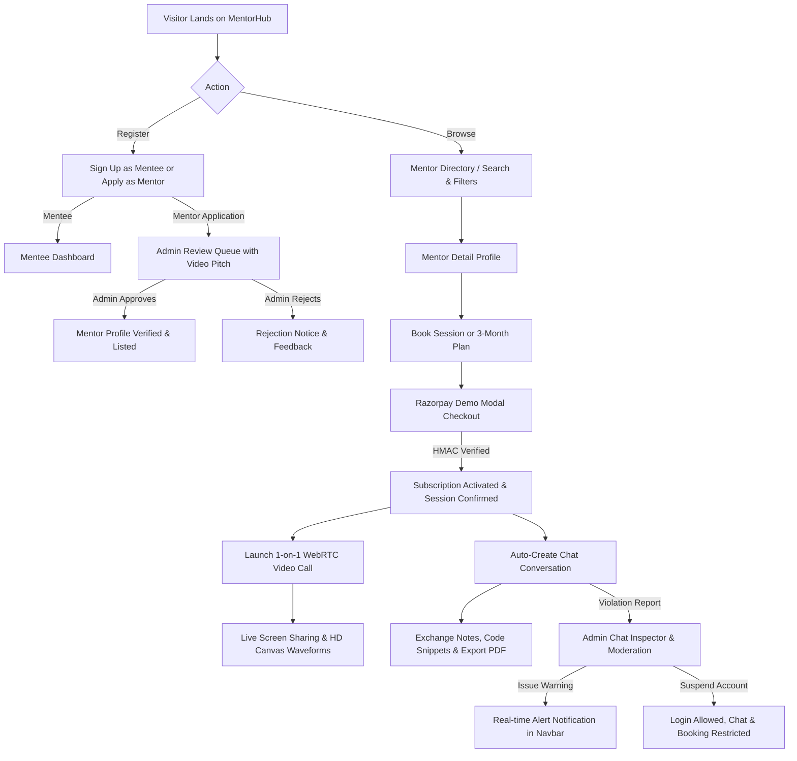

# MentorHub — Complete Architecture & Tech Stack Documentation

Welcome to the comprehensive technical documentation for **MentorHub**, an enterprise-grade 1-on-1 mentorship, video coaching, and career guidance marketplace.

---

## 📑 Table of Contents
1. [Tech Stack Breakdown & Where Each Is Used](#1-tech-stack-breakdown--where-each-is-used)
2. [End-to-End Project Workflow](#2-end-to-end-project-workflow)
3. [Page Routing & Frontend Architecture](#3-page-routing--frontend-architecture)
4. [Critical Technical Implementations & Code Highlights](#4-critical-technical-implementations--code-highlights)
5. [Complete Folder Structure Breakdown](#5-complete-folder-structure-breakdown)

---

## 1. Tech Stack Breakdown & Where Each Is Used

### 🌐 Frontend Architecture
| Technology | Version | Where Used & Purpose |
| :--- | :--- | :--- |
| **React** | `18.2.0` | Powers the reactive single-page user interface (SPA), state management via React Context (`AuthContext.jsx`), hooks (`useEffect`, `useRef`, `useState`, `useCallback`). |
| **Vite** | `5.2.0` | Lightning-fast development server with Hot Module Replacement (HMR) and optimized ES-module production bundling. |
| **React Router DOM** | `6.22.3` | Client-side routing, declarative page transitions, URL query param parsing, protected routes (`ProtectedRoute.jsx`). |
| **Axios** | `1.6.8` | HTTP client with global request/response interceptors in `client.js` for automatic JWT Bearer token attachment and 401 Unauthorized handling. |
| **WebRTC API** | Native Browser API | Peer-to-peer audio/video streaming (`RTCPeerConnection`, `MediaStream`, `RTCSessionDescription`, `RTCIceCandidate`) inside `WebRTCVideoCall.jsx`. |
| **HTML5 Canvas & Web Audio API** | Native Browser API | Generates an animated 60 FPS fallback video stream with live dynamic audio waveforms when physical cameras are busy or restricted. |
| **Screen Capture API** | Native Browser API | `navigator.mediaDevices.getDisplayMedia()` paired with WebRTC `RTCRtpSender.replaceTrack()` to stream HD desktop screens during 1-on-1 calls. |
| **Lucide React** | `0.363.0` | Modern, cohesive SVG icon system used across navigation, video controls, dashboards, and badges. |
| **Neo-Brutalist CSS System** | Vanilla CSS | Custom design token system in `index.css` featuring dark-mode glassmorphism (`backdrop-filter`), vibrant neon accents (`--neon-lime`, `--neon-cyan`, `--neon-coral`), sharp borders, and bold micro-interactions. |

---

### ⚙️ Backend Architecture
| Technology | Version | Where Used & Purpose |
| :--- | :--- | :--- |
| **Python** | `3.10+` | Core programming language for all backend logic, serializers, APIs, and data seeding scripts. |
| **Django** | `4.2 LTS` | High-level web framework providing ORM database models, migrations, URL dispatchers, security rules, and static/media file handling. |
| **Django REST Framework (DRF)** | `3.14.0` | REST API architecture, class-based views (`APIView`), model serializers, parsers (JSON, MultiPart, Form), and permission classes. |
| **SimpleJWT** | `5.3.0` | Stateless JSON Web Token authentication (`/api/v1/accounts/login/`, token refresh, RBAC role claims). |
| **Razorpay API SDK** | Custom HMAC-SHA256 Service | Handles order creation (`POST /sessions/razorpay/create-order/`), currency conversions in INR, and cryptographic signature verification (`VerifyPaymentView`). |
| **ReportLab** | `3.6.12` | Server-side PDF document generator (`ExportChatPDFView` in `chat/api_views.py`) creating styled downloadable coaching session notes and transcripts. |
| **Pillow (PIL)** | `9.5.0` | Image processing library for user avatar uploads and thumbnail optimization. |
| **WhiteNoise** | `6.6.0` | Production static file serving with gzip/brotli compression and cache headers directly from Gunicorn. |
| **Gunicorn** | `21.2.0` | Production WSGI HTTP server running multi-worker concurrent Python processes. |
| **SQLite / PostgreSQL** | Native / Cloud | Default zero-configuration database (`db.sqlite3`) with support for PostgreSQL in production. |

---

## 2. End-to-End Project Workflow



### Detailed Workflow Stages:

1. **User Authentication & Role-Based Access Control (RBAC)**:
   - Users register either as a **Mentee** (instant access) or apply as a **Mentor** (submits experience, hourly/monthly rates, and a demo pitch video link).
   - JWT tokens containing `user_id`, `role`, and `is_suspended` claims are issued upon login and stored in client `localStorage`.

2. **Mentor Discovery & Multi-Filter Search Engine**:
   - Mentees search mentors by name, keyword, technical skills (`Python`, `System Design`, `React`, `AI/ML`), minimum rating, maximum hourly rate, and years of experience.
   - Profile cards show rating stars, reviews count, hourly rates, and a **"Demo Pitch"** button that opens `VideoPlayerModal` streaming the mentor's intro video.

3. **Multi-Tier Mentorship Plans & Razorpay Checkout**:
   - **Single Session**: 1-on-1 coaching call (60 mins).
   - **1-Month Plan**: Dedicated monthly mentorship with unlimited 1-on-1 session requests.
   - **3-Month Career Transformation Plan**: Comprehensive 90-day guidance with priority scheduling.
   - Payment order is created on backend (`/sessions/razorpay/create-order/`), opened in `RazorpayDemoModal.jsx`, and cryptographically validated via HMAC-SHA256 signature verification.

4. **Instant Chat Sync & Notification System**:
   - When a session is booked, a `ChatRoom` is automatically created, instantly appearing on both the Mentee and Mentor chat sidebars (`/chat`).
   - The platform sends a welcome confirmation message into the chat and triggers a Navbar **Notification Bell** alert.

5. **WebRTC Peer-to-Peer 1-on-1 Video Calling & Screen Sharing**:
   - Mentees and mentors launch the encrypted room via `/sessions/live/:id`.
   - Uses a **Dual-Signaling Engine**: Combines instant `BroadcastChannel` (for same-device tabs) with a **Backend Signal Relay API** (`/sessions/live/:id/signal/` polled every 800ms) for reliable cross-browser/cross-network connections.
   - **Screen Sharing**: Uses `replaceTrack()` so the remote peer receives full-resolution desktop sharing with zero stream restarts.
   - **HD Canvas Waveform Fallback**: If physical hardware is unavailable or in use by another tab, an animated 60 FPS studio canvas stream with dynamic FFT audio waveform bars is seamlessly generated.

6. **Admin Moderation, Chat Inspector & Account Restrictions**:
   - Admins access the **Admin Control Center** (`/admin/dashboard`).
   - Review pending mentor applications with video pitches and approve/reject with feedback notes.
   - Investigate user violation reports in the **Chat Inspector Modal** with full chat history inspection.
   - Admins can issue **Official Warnings** (sent to the user's notification bell) or **Suspend Accounts**.
   - **Suspension Policy**: Suspended users can still log in and view their dashboards, but cannot chat, send files, or book new sessions.

---

## 3. Page Routing & Frontend Architecture

| Route Path | Page Component | Access Level | Purpose & Key Features |
| :--- | :--- | :--- | :--- |
| `/` | `LandingPage.jsx` | Public | Hero banner, platform metrics, featured verified mentors, and video previews. |
| `/mentors` | `MentorDirectory.jsx` | Public | Search directory with multi-filter sidebar (skills, price, rating, experience) and booking trigger. |
| `/mentors/:id` | `MentorDetail.jsx` | Public | Full mentor profile, skills badges, student reviews, pricing plan selector, and report button. |
| `/login` | `LoginPage.jsx` | Public (Guest) | Dual-tab JWT authentication for Mentees, Mentors, and Administrators. |
| `/register` | `RegisterPage.jsx` | Public (Guest) | Student/Mentee registration form. |
| `/apply` | `MentorApplicationPage.jsx` | Public | Mentor application form with demo video pitch upload / URL submission. |
| `/mentee/dashboard` | `MenteeDashboard.jsx` | Protected (Mentee) | Active 3-month plans, upcoming sessions, review submission modal, and suspension alerts. |
| `/mentor/dashboard` | `MentorDashboard.jsx` | Protected (Mentor) | Incoming session requests, accept/reject buttons, active live call launch banner, and earnings summary. |
| `/chat` | `ChatPage.jsx` | Protected (All) | Real-time messaging, note-taking mode, file attachments, PDF export, and incident report modal. |
| `/sessions/live/:id` | `WebRTCVideoCall.jsx` | Protected (All) | WebRTC 1-on-1 video call, track-replacement screen sharing, mic/cam toggles, and animated canvas fallback. |
| `/admin/dashboard` | `AdminDashboard.jsx` | Protected (Admin) | Platform analytics, mentor approval queue with video preview, user management, and report chat inspector. |
| `/profile` | `ProfilePage.jsx` | Protected (All) | Edit bio, hourly/monthly rates, skills, and profile photo. |

---

## 4. Critical Technical Implementations & Code Highlights

### 🔹 1. WebRTC Dual Signaling Relay & Screen Sharing
Located in [`frontend/src/pages/WebRTCVideoCall.jsx`](file:///c:/Users/kaila/OneDrive/Desktop/guidance%20hub/mentor_hub/frontend/src/pages/WebRTCVideoCall.jsx) & [`sessions_app/api_views.py`](file:///c:/Users/kaila/OneDrive/Desktop/guidance%20hub/mentor_hub/sessions_app/api_views.py):

```javascript
// Screen Sharing via RTCRtpSender Track Replacement
const toggleScreenShare = async () => {
  if (!isScreenSharing) {
    const screenStream = await navigator.mediaDevices.getDisplayMedia({ video: true, audio: true });
    const screenTrack = screenStream.getVideoTracks()[0];
    
    // Replace track on existing peer connection without restarting call
    const senders = peerConnectionRef.current.getSenders();
    const videoSender = senders.find((s) => s.track && s.track.kind === 'video');
    if (videoSender) {
      await videoSender.replaceTrack(screenTrack);
    }
    
    // Broadcast status to remote peer
    broadcastSignal({ type: 'screen_share_status', isSharing: true, sender: role });
  }
};
```

---

### 🔹 2. Razorpay HMAC-SHA256 Payment Verification
Located in [`sessions_app/api_views.py`](file:///c:/Users/kaila/OneDrive/Desktop/guidance%20hub/mentor_hub/sessions_app/api_views.py#L115):

```python
import hmac, hashlib

def verify_razorpay_signature(order_id, payment_id, signature, key_secret):
    payload = f"{order_id}|{payment_id}".encode('utf-8')
    generated_signature = hmac.new(
        key_secret.encode('utf-8'),
        payload,
        hashlib.sha256
    ).hexdigest()
    return hmac.compare_digest(generated_signature, signature)
```

---

### 🔹 3. Server-Side PDF Chat Transcript Generation
Located in [`chat/api_views.py`](file:///c:/Users/kaila/OneDrive/Desktop/guidance%20hub/mentor_hub/chat/api_views.py#L125) using ReportLab:

```python
from reportlab.platypus import SimpleDocTemplate, Paragraph, Spacer
from reportlab.lib.styles import getSampleStyleSheet, ParagraphStyle

class ExportChatPDFView(views.APIView):
    def get(self, request, room_id):
        # Generates structured coaching notes and chat history PDF
        buffer = io.BytesIO()
        doc = SimpleDocTemplate(buffer, pagesize=letter)
        # Renders session header, mentor/mentee badges, notes and timestamps
        doc.build(story)
        buffer.seek(0)
        return HttpResponse(buffer, content_type='application/pdf')
```

---

### 🔹 4. Real-time Notification Dropdown & Polling
Located in [`frontend/src/components/Navbar.jsx`](file:///c:/Users/kaila/OneDrive/Desktop/guidance%20hub/mentor_hub/frontend/src/components/Navbar.jsx) & [`NotificationDropdown.jsx`](file:///c:/Users/kaila/OneDrive/Desktop/guidance%20hub/mentor_hub/frontend/src/components/NotificationDropdown.jsx):

- Automatically polls `GET /api/v1/accounts/notifications/` every 4 seconds.
- Displays colored badges for **Official Warnings** (⚠️ Yellow), **Account Suspension** (🚫 Red), **Mentor Approvals** (🎉 Green), and **Session Alerts** (📅 Blue).

---

## 5. Complete Folder Structure Breakdown

```
mentor_hub/
├── accounts/                     # User Auth, Profiles, Notifications & Reports
│   ├── management/commands/      # Custom management scripts
│   │   └── seed_demo_data.py     # Database seeding command for instant testing
│   ├── api_views.py              # Auth, Registration, Report & Notification REST APIs
│   ├── models.py                 # User, MentorProfile, MenteeProfile, UserReport, Notification
│   ├── serializers.py            # DRF serializers for account objects
│   └── urls_api.py               # Account API route definitions
│
├── chat/                         # Real-time Chat, Notes & PDF Export
│   ├── api_views.py              # Chat room listing, message sending, PDF generator
│   ├── models.py                 # ChatRoom and Message models
│   ├── serializers.py            # Serializers with dynamic avatars & unread counters
│   └── urls_api.py               # Chat endpoint routes
│
├── dashboard/                    # Admin Control Center & Analytics
│   ├── api_views.py              # Mentor approvals/rejections, stats, moderation actions
│   └── urls_api.py               # Admin endpoints
│
├── sessions_app/                 # Sessions, Subscriptions, Razorpay & WebRTC
│   ├── api_views.py              # Razorpay order create/verify, WebRTC signal relay, booking
│   ├── models.py                 # SessionRequest, MentorshipSubscription, LiveSession, Review
│   ├── razorpay_service.py       # Razorpay cryptographic helper service
│   ├── serializers.py            # Session & Subscription serializers
│   └── urls_api.py               # Session endpoints
│
├── mentor_hub/                   # Django Project Configuration Root
│   ├── settings.py               # Installed apps, JWT config, CORS, Static/Media setup
│   ├── urls.py                   # Root URL router uniting all API endpoints
│   └── wsgi.py                   # Production WSGI application entrypoint
│
├── docs/                         # Comprehensive Documentation
│   ├── README.md                 # Documentation Master Index
│   ├── ARCHITECTURE_AND_TECHSTACK.md # Architecture, Tech Stack & Workflow Guide
│   └── DEPLOYMENT_GUIDE.md       # Vercel & Render Deployment Manual
│
├── frontend/                     # React Single Page Application
│   ├── public/                   # Static favicon and public assets
│   ├── src/
│   │   ├── api/                  # Axios API service clients
│   │   │   ├── client.js         # Axios instance with JWT interceptors
│   │   │   ├── auth.js           # Auth & Notification endpoints
│   │   │   ├── chat.js           # Chat & Message endpoints
│   │   │   ├── admin.js          # Admin & Stats endpoints
│   │   │   └── sessions.js       # Booking, Razorpay & WebRTC signal endpoints
│   │   ├── components/           # Reusable UI Components
│   │   │   ├── Navbar.jsx        # Navigation bar with notification bell & badge counters
│   │   │   ├── NotificationDropdown.jsx # Real-time notification drawer
│   │   │   ├── VideoPlayerModal.jsx     # YouTube & media pitch video player
│   │   │   ├── SessionBookingModal.jsx  # Multi-plan selector & booking modal
│   │   │   ├── RazorpayDemoModal.jsx    # Razorpay checkout simulation modal
│   │   │   ├── ChatInspectorModal.jsx   # Admin chat history analysis & moderation modal
│   │   │   ├── ReportUserModal.jsx      # Mentee/mentor violation report modal
│   │   │   └── ReviewModal.jsx          # Star rating & feedback submission modal
│   │   ├── context/
│   │   │   └── AuthContext.jsx   # Global user state, login/logout, JWT token storage
│   │   ├── pages/                # Primary Route Views
│   │   │   ├── LandingPage.jsx          # Public homepage & hero section
│   │   │   ├── MentorDirectory.jsx      # Search & filterable mentor marketplace
│   │   │   ├── MentorDetail.jsx         # Mentor profile, reviews, and booking
│   │   │   ├── MenteeDashboard.jsx      # Student dashboard & active subscriptions
│   │   │   ├── MentorDashboard.jsx      # Mentor workspace & session request manager
│   │   │   ├── ChatPage.jsx             # Chat interface with notes mode & PDF export
│   │   │   ├── WebRTCVideoCall.jsx      # 1-on-1 video calling & screen sharing arena
│   │   │   ├── AdminDashboard.jsx       # Admin approval queue & user management
│   │   │   └── ProfilePage.jsx          # Profile settings
│   │   ├── App.jsx               # Application routes & layout wrapper
│   │   ├── main.jsx              # React DOM root mounting
│   │   └── index.css             # Neo-brutalist theme design system
│   ├── package.json              # Frontend NPM dependencies & scripts
│   ├── vercel.json               # SPA routing rewrite rule for Vercel
│   └── vite.config.js            # Vite build configuration
│
├── build.sh                      # Render automated build & migration script
├── Procfile                      # Gunicorn process manager definition
├── render.yaml                   # Infrastructure-as-code configuration for Render
├── requirements.txt              # Python production dependencies
└── manage.py                     # Django CLI management entrypoint
```
